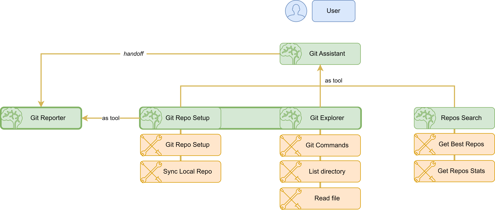

# GitLLM Explorer
**AI-Powered CLI for Exploring Git Repositories**

## Description

GitLLM Explorer is an AI-powered command-line tool that leverages LLM-based agents to help developers and teams explore and understand Git repositories. By asking natural language questions, users can:

- Summarize a repository's purpose and structure.
- Analyze branch activity and workflows.
- Generate detailed repository reports.
- Search for GitHub repositories based on topics.

## Key Features

- **Natural Language Interface**
  - Ask questions in plain English; the AI translates them into Git commands or queries.
  - Maintains conversational context for follow-up queries.
- **Modular LLM Agents**
  - **Setup Agent**: Clone and initialize repositories.
  - **Commands Agent**: Execute safe Git commands and fetch data.
  - **Report Agent**: Generate human-readable reports on repository history and structure.
  - **Assistant Agent**: Orchestrates agent interactions for smooth workflows.
- **Repository Insights and Analytics**
  - Summaries based on README and code.
  - Branch activity and merge history.
  - Workflow strategy detection (e.g., Git Flow, GitHub Flow).
- **Repository Search**
  - Discover GitHub repositories by topic, stars, or activity.
- **Asynchronous and Extensible**
  - Built with asyncio for responsive CLI interactions.
  - Easily extendable with new agents and tools.
- **Configurable LLM Models**
  - Customize each agent's model via environment variables.

## Installation

### Prerequisites

- Python 3.8 or higher
- [uv](https://github.com/astral-sh/uv)

### Setup

1. Install `uv`:

   ```bash
   curl -sSf https://install.python-uv.org | sh
   # On macOS, follow instructions at https://docs.astral.sh/uv/getting-started/installation/
   ```

2. Clone the repository:

   ```bash
   git clone https://github.com/DSmmartin/msft-hackaton-gitllmexplorer.git
   cd msft-hackaton-gitllmexplorer
   ```

3. Create and activate the virtual environment:

   ```bash
   uv sync && uv venv
   source .venv/bin/activate  # On Windows: .venv\Scripts\activate
   ```

4. Install dependencies:

   ```bash
   uv install
   ```

## Configuration

Set the following environment variables:

- `GITHUB_TOKEN`: Your GitHub token (optional; for the search functionallity).
- Agent-specific model variables (optional; defaults to `gpt-4o-mini`):
  - `GIT_ASSISTANT_MODEL`
  - `GIT_COMMANDS_MODEL`
  - `GIT_REPORT_MODEL`
  - `GIT_SETUP_MODEL`
  - `OPENAI_API_KEY`: Your OpenAI API key, in case you want to use the OpenAI provider.
  - `AZURE_OPENAI_API_KEY`, `AZURE_OPENAI_API_VERSION`,  `AZURE_OPENAI_ENDPOINT`: The credentials for the Azure OpenAI provider.


## Usage

Run the CLI:

```bash
uv run ./src/main.py
```

Once launched, type your questions about Git repositories. Type `exit` to quit.

## Examples

- **Summarize a repository**:

  ```bash
  💬 Could you provide a summary about this repo based on the README? The URL is https://github.com/microsoft/promptflow.git
  ```

- **List active branches** in a local repo:

  ```bash
  💬 What are the current active branches in /path/to/repo?
  ```

- **Generate a repository report**:

  ```bash
  💬 Generate a report of the repository: https://github.com/microsoft/promptflow.git
  ```

- **Search for Python repos**:

  ```bash
  💬 Find me the best repositories about transformers
  ```

## Use Cases

- **Developer Onboarding**: Quickly understand a new codebase.
- **Branch Strategy Audits**: Analyze branch workflows (Git Flow, GitHub Flow, etc.).
- **Project Audits**: Generate automated reports for stakeholders.
- **Repository Discovery**: Find relevant open-source projects.

## Technical Explanation



1. **Agent Orchestration**: Uses a Runner to sequentially call LLM agents based on responses, this is the Git Assistant and the Git Reporter when the `handoff` operations is executed.
2. **Tools Integration**: There are other Agents used as tools that group high level tasks, these agents facilitate the execution of complex workflows.
3. **Context Management**: Pydantic models (`GitRepository`, `ListOfRepositories`) store agent context.
4. **Asynchronous CLI**: Built with asyncio and Rich for interactive consoles.


## Future steps and potential new features

- Improving the Git Exploratory analisis tool which more detailed information such as:
    1. The tags
    2. Core components/folders of the repository
    3. The main issues and pull requests
- Packaging the tool in a CLI library
- Building a TUI for the tool (the Textual library)
- Integrating some Git commands with the [Git MCP](https://github.com/modelcontextprotocol/servers/tree/main/src/git)
- Adding unit tests for core functionalities
- Building a RAG with the book "PRO GIT" by Scott Chacon and Ben Straub, in order to extend the capabilities of this tool to tutor/learning.
- Add traceability to the tool (`promptflow`), in order to track the redirections, the use of the tools and the agents, and the use of the LLMs.
- Build a Evaluation system to evaluate the performance of the tool/agents, and the LLMs used in the tool.
